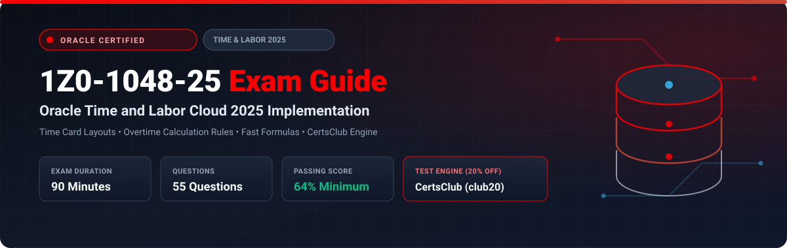

  

# Oracle Time and Labor Cloud 2025 Implementation Professional (1Z0-1048-25) Exam Study Guide & Practice Test Resource Portal

[-f80000?style=for-the-badge&logo=oracle&logoColor=white)](https://education.oracle.com/)
[-f80000?style=for-the-badge&logo=oracle)](https://education.oracle.com/)

[-28a745?style=for-the-badge&logo=shield)](https://www.certsclub.com/oracle/)

---

## 1. Exam Overview & Candidate Profile

The **Oracle Time and Labor Cloud 2025 Implementation Professional (1Z0-1048-25)** exam certifies that a consultant has the technical competence to configure and deploy Oracle Fusion Cloud Time and Labor. Tested topics include repeating time periods, time consumer sets (Payroll and Project Costing), time card layout sets, overtime calculation rules, time entry validations, shift tolerances, and approval workflows.

Passing 1Z0-1048-25 awards the **Oracle Time and Labor Cloud 2025 Certified Implementation Professional** credential.

### Target Candidate Profile & Career Roles
* **Time and Attendance Functional Implementers**
* **Workforce Management & Payroll Solutions Consultants**
* **HCM Cloud Technical Architects**

---

## 2. Key Exam Specifications

| Parameter | Official Specification |
| :--- | :--- |
| **Exam Code** | 1Z0-1048-25 |
| **Exam Title** | Oracle Time and Labor Cloud 2025 Implementation Professional |
| **Associated Credential** | Oracle Time and Labor Cloud 2025 Certified Implementation Professional |
| **Duration** | 90 Minutes |
| **Number of Questions** | 55 Questions |
| **Passing Score** | 64% |
| **Question Format** | Multiple Choice (Single and Multiple Select) |
| **Delivery Vendor** | Pearson VUE / Oracle University Online Remote Proctoring |
| **Recommended Practice Test Engine** | **[1Z0-1048-25 Practice Test - CertsClub](https://www.certsclub.com/oracle/)** (Coupon: `club20` for 20% off) |

---

## 3. Official Blueprint & Exam Domain Breakdown

| Domain Code | Domain Title | Weighting | Key Competencies Covered |
| :--- | :--- | :---: | :--- |
| **1.0** | **Repeating Time Periods & Time Consumer Sets** | **20%** | Weekly, bi-weekly, and monthly repeating time periods; Configuring Time Consumer Sets for Payroll and Project Costing. |
| **2.0** | **Time Card Layouts & Template Customization** | **25%** | Layout sets, Responsive time card screens, Entry-level vs Day-level fields, Time card configurations for workers and managers. |
| **3.0** | **Time Calculation Rules & Rule Sets** | **25%** | Overtime threshold rules (Daily, Weekly, 7th consecutive day); Premium calculation rules; Fast Formulas for custom time rules. |
| **4.0** | **Validation Rules & Shift Tolerances** | **15%** | Web clock configurations, Geofencing, Shift tolerances, Early/late punch grace periods. |
| **5.0** | **Approval Workflows & Payroll Transfers** | **15%** | BPM time card approval rules, Mass submit/approve, Generate Time Cards process, Transfer Time to Payroll. |

---

## 4. Scenario-Based Demo Question & Explanation

### Question 1: Time Consumer Set Priority
**Scenario:** A worker enters 8 hours charged to a capital project on Monday. The enterprise integrates Oracle Time and Labor with both Oracle Global Payroll and Oracle Project Costing.

How does Oracle Time and Labor ensure that both Payroll and Projects receive the approved time card data accurately?

A) The worker must submit two separate time cards.  
B) Configure a unified **Time Consumer Set** that enables both Payroll and Project Costing, linking the appropriate approval and validation rules for each consumer.  
C) Export data via CSV and import manually into Projects.  
D) Projects cannot receive time from Time and Labor directly.  

**Correct Answer:** **B**

**Detailed Explanation:**
* In Oracle Time and Labor, a **Time Consumer Set** defines which downstream applications consume the time data (e.g., Payroll, Project Costing). A unified Consumer Set allows a single time card to validate against rules for both consumers and simultaneously transfer to both upon approval.

---

## 5. Recommended Preparation Strategy & Practice Testing Engine

1. **Configure Time Rules & Layout Sets:** Practice setting up daily 8-hour and weekly 40-hour overtime rules in an HCM sandbox.
2. **Practice with Full-Length Mock Exams:** Use **[CertsClub Oracle 1Z0-1048-25 Practice Tests](https://www.certsclub.com/oracle/)**.
   * Up-to-date scenario questions covering time calculations, consumer sets, and layout design.
   * Enter discount coupon code **`club20`** at checkout on [CertsClub](https://www.certsclub.com/oracle/) for an immediate 20% discount.

---

## 6. Official Documentation & References

* [Oracle Fusion Cloud Time and Labor Documentation](https://docs.oracle.com/en/cloud/saas/human-resources/time-and-labor/)
* [Oracle University 1Z0-1048-25 Exam Details](https://education.oracle.com/)
* [CertsClub 1Z0-1048-25 Practice Engine](https://www.certsclub.com/oracle/)
